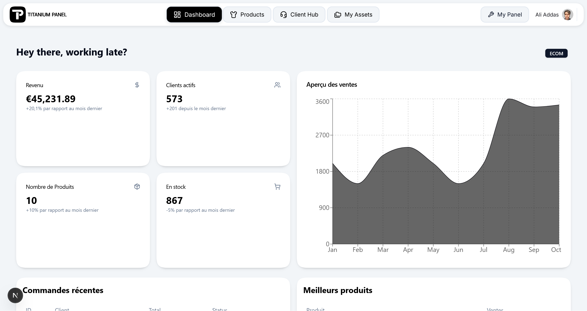

# Titanium E-Commerce

A full-stack e-commerce platform built with Next.js 16. This is a learning/portfolio project exploring modern web development patterns.



## What's in here

This monorepo contains three projects that work together:

| Project | What it does | Port |
|---------|--------------|------|
| [titanium-panel](./titanium-panel) | Admin dashboard - manage stores, products, orders | `3000` |
| [boutique-front](./boutique-front) | Customer storefront - displays products from the panel | `4001` |
| [ws-server](./ws-server) | WebSocket server for real-time chat | `4000` |

## Quick Start

**Prerequisites:** Node.js 18+, PostgreSQL, yarn

```bash
# Clone and install
git clone https://github.com/aliaddas/titanium-panel.git
cd titanium-panel

# Install each project
cd titanium-panel && yarn install
cd ../boutique-front && yarn install  
cd ../ws-server && yarn install
```

Copy `.env.example` to `.env` in each project and fill in your values.

```bash
# Run everything (in separate terminals)
cd titanium-panel && yarn dev    # localhost:3000
cd boutique-front && yarn dev    # localhost:4001
cd ws-server && yarn dev         # ws://localhost:4000
```

## Tech Stack

- **Framework:** Next.js 16 (App Router)
- **Database:** PostgreSQL + Prisma
- **Auth:** Clerk
- **Storage:** Supabase
- **UI:** Tailwind CSS, Radix UI, shadcn/ui
- **State:** Zustand
- **Real-time:** Custom WebSocket server

## Current State

This is a work-in-progress prototype. What works:

- Multi-store management
- Product CRUD with variants (sizes, colors, etc.)
- Image uploads
- Order management
- Basic customer support chat

What's next:

- Shopping cart & checkout
- Payment integration
- Better mobile experience

## Project Structure

```
titanium-ecommerce/
├── titanium-panel/     # Admin dashboard (Next.js)
├── boutique-front/     # Storefront (Next.js)
└── ws-server/          # Chat server (Node.js + ws)
```

See each project's README for more details.

## License

MIT
