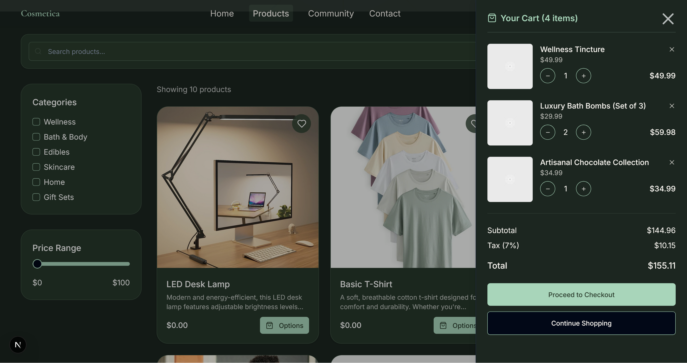

# Boutique Front

Demo storefront that displays products from the Titanium Panel.



## Getting Started

```bash
yarn install
cp .env.example .env
yarn dev
```

Opens at [http://localhost:4001](http://localhost:4001).

## Environment

Just needs the database connection (same as the panel):

```env
DATABASE_URL_DEV_LOCAL="postgresql://..."
```

## Structure

```
app/
├── page.tsx              # Homepage
├── products/             # Product listing
│   └── [productID]/      # Product detail
└── community/            # (placeholder)

components/
├── ui/                   # shadcn components
├── product-card.tsx
└── site-header.tsx
```

## Notes

- This is a read-only view of products created in the panel
- Port 4001 avoids conflict with the WebSocket server on 4000
- Same Prisma schema as the panel

---

Back to [main README](../README.md)
